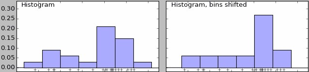
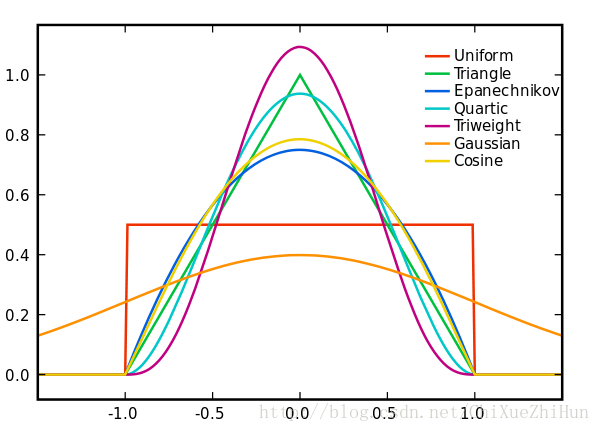
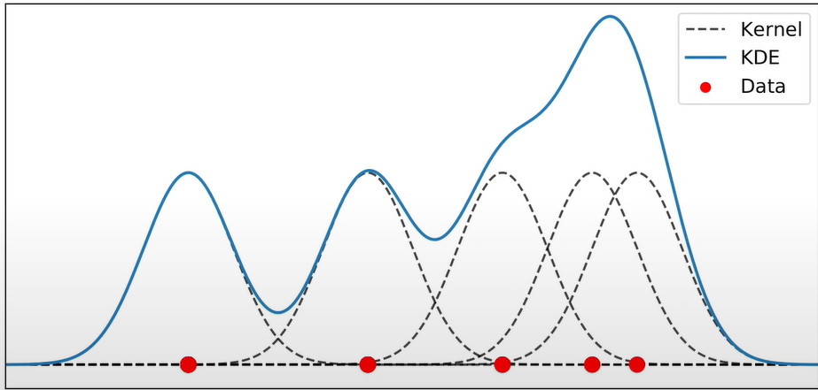
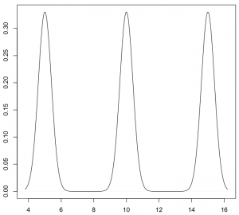
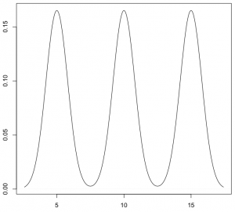
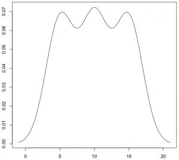
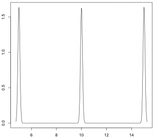
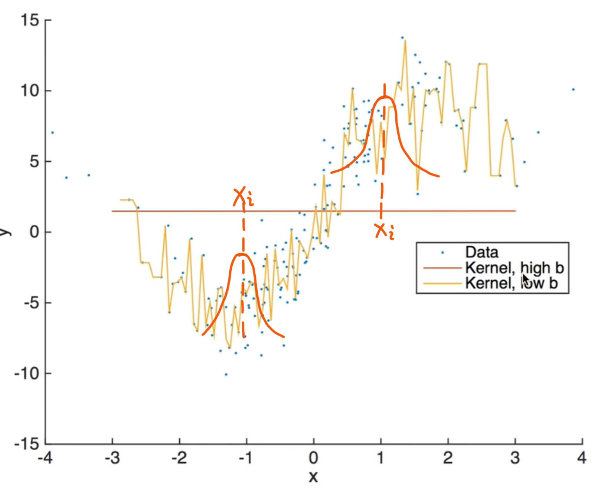

## **参数估计 VS 非参数估计**

参数估计：假设总体服从带未知参数的某种分布或具体的回归函数，并据此估计其未知参数。其优点是比较有效率且容易操作，其缺点是对模型设定所作的假定较强，可能导致较大的“设定误差”。  

非参数估计：一般不对模型的具体分布或函数形式作任何假定，是一种从数据样本本身出发研究数据分布特征的方法，因此更加稳健。但其缺点是，要求的样本容量较大，且估计量收敛到真实值的速度较慢。  

## **直方图的缺陷**
在非参数估计中，画直方图是一种被广泛应用的密度函数估计方法，但是它存在一定的缺陷:  
1. 得到的密度函数是不光滑的；  
2. 密度函数受子区间宽度影响较大。  

其中，直方图不能得到光滑密度估计的根本原因是由于它使用了示性函数作为权重函数，并且它的各组之间不允许交叠。  
 

## **核函数**
为了让核密度估计得到光滑的密度函数，我们需要让它使用更一般的权重函数，并允许各组交叠。其中，权重函数就是“核函数”。  

在核密度估计中，核函数通常选择平滑的峰值函数来拟合远小近大的权重规律，且要求选择函数满足下面两个性质：  
1. 归一化：曲线下方面积为1；  
2.对称性：函数连续且关于原点对称。  

## **核密度估计**
所谓核密度估计，就是采用平滑的峰值函数(“核函数”)来拟合观察到的数据点，从而对真实的概率分布曲线进行模拟。
 

## **带宽**
核密度估计无法消除直方图中“密度函数受子区间宽度影响”的影响。

带宽：子区间的半径，定义了“在数据点附近邻域的大小”，通常用h表示；  
窗宽：子区间的直径，通常用2h表示。  

带宽反映了密度函数曲线整体的平坦程度，也即观察到的数据点在曲线形成过程中所占的比重。带宽越大，观察到的数据点在最终形成的曲线形状中所占比重越小，整体曲线就越平坦；带宽越小，观察到的数据点在最终形成的曲线形状中所占比重越大，整体曲线就越陡峭。  

## **带宽对密度函数的影响**

  

  

 

  

  

## **最优带宽**
在核密度估计中，带宽的选择远比核函数的选择更重要。  

如果带宽越大，数据点附近的邻域就越大，偏差也越大(偏差与$h^2$成正比)；另一方面，如果带宽越大，密度函数曲线就越光滑，即方差越小(方差与$\frac{1}{nh}$成正比)。

因此，在选择最优带宽时，为保证偏差和方差都不大，我们最小化均方误差(MSE)，即使估计量方差与偏差平方和最小。  

$$
\min _{h} \operatorname{MSE}\left[\hat{f}\left(x_{0}\right)\right]=\left[\operatorname{Bias}\left(x_{0}\right)\right]^{2}+\operatorname{Var}\left[\hat{f}\left(x_{0}\right)\right]
$$

## **非参数核回归**
非参数核回归是利用核函数和带宽构建的一种非参数回归方法。考虑以下非参数一元非参数回归模型：
$$
y_{i}=m\left(x_{i}\right)+\varepsilon_{i}
$$

该模型的困难(与优点)在于$m(.)$是未知函数(连函数形式都未知)。因此我们只知道x与y之间存在回归关系，但是无法知道其具体表达式。  

非参数回归的思想是：对于每个i，分别估计$m\left(x_{i}\right)$，从而得到对回归函数$m(x)$的估计。在某种意义上，这种回归方法并不用于求模型的解析解，而求其数值解。

## **非参数核回归**

