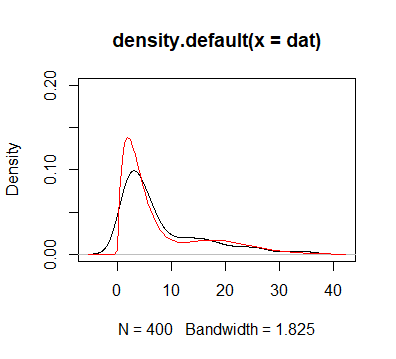
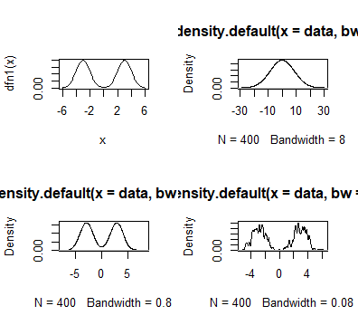

## **核密度估计**

```{r ,eval=FALSE}
set.seed(10)  
dat<-c(rgamma(300,shape=2,scale=2),rgamma(100,shape=10,scale=2))  
plot(density(dat,kernel = "gaussian" ), ylim=c(0,0.2))  
dfn<-function(x,a,alpha1,alpha2,theta){  
  a*dgamma(x,shape=alpha1,scale=theta)+(1-a)*dgamma(x,shape=alpha2,scale=theta)}  
curve(dfn(x,0.75,2,10,2),add=T,col="red",)  

```  
<div align=center></div>
## **带宽的选择**
```{r ,eval=FALSE}
dfn1<-function(x){  
  0.5*dnorm(x,3,1)+0.5*dnorm(x,-3,1)}  
par(mfrow=c(2,2))  
curve(dfn1(x),from=-6,to=6)  
data<-c(rnorm(200,3,1),rnorm(200,-3,1))  
plot(density(data,bw=8))  
plot(density(data,bw=0.8))  
plot(density(data,bw=0.08))

```
## **带宽的选择**
<div align=center></div>

## **武汉人员迁徙地图**
```{r ,eval=FALSE}
library(usethis)
library(devtools)
library(REmap)
options(remap.ak = "9H3FoljQv8CGKeWWrxtFVNEGCTd8Ui8z" )   
destin <- read.csv(file="destination.csv",header=F)
names(destin) <- c("names","values")
markLine_data <- data.frame(origin=rep("武汉",10),
                            destination=destin[1:10,1],
                            color=rep("#fff",10)
)
markPoint_data <- markLine_data[markLine_data!=""]
markPoint_data1 <- markPoint_data[which(markPoint_data!="武汉"&markPoint_data!="#fff")]

```
## **武汉人员迁徙地图**
```{r ,eval=FALSE}
remapC(destin, title="2020年1月10日至2020年1月24日 武汉人口迁出图", subtitle="前10目标省份",
       theme=get_theme(theme="Dark",  #背景颜色
                       lineColor = "#FFFFFF",  #线条颜色
                       titleColor = "#FFFFFF",  #标题颜色
                       pointShow = T,  #是否展示各省会城市所在点，设置为True时展示
                      ),
       color=c('#CD0000','#FFEC8B'), #颜色渐变方案  
       markLineData=markLine_data,   
       markLineTheme=markLineControl(color="white", 
                                     lineWidth=2, #线条宽度
                                     lineType="dashed"   #线条形状：虚线
                                    ),  #对图中线的样式进行调整
       markPointData=markPoint_data1,
       markPointTheme=markPointControl(symbolSize=13,  #调整点的大小
                                       effect=T,     #调整点是否显示动态效果
                                       effectType="scale",    #调整点的形状
                                       color="white"
                                      )  #对图中点的样式进行调整
)
```
## **全国疫情地图**
```{r ,eval=FALSE}
library(REmap)
data <- read.csv(file="data.csv",header=F)
names(data) <- c("names","values")
remapC(data,
       maptype = 'china',
       color = c('#CD0000','#FFEC8B'),   
       theme = get_theme("dark"),
       title = "全国疫情地图",
       subtitle="2月11日累计确诊人数",
)
```

