## **展示内容**

### 1.林华珍教授团队最新研究分享

### 2.非参数核密度估计方法  

### 3.R语言实操简介


# 1.林华珍教授团队最新研究分享

## **文章概述**  

题目：《Trends in Transmissibility of 2019 Novel Coronavirus-infected Pneumonia in Wuhan and 29 Provinces in China》  

&emsp;&emsp;&emsp;《中国武汉和29省的新冠肺炎传播趋势》

作者：林华珍，刘伟，高宏，聂锦宇，范乔  

* 数据  

* 模型  

* 结果
  
## **数据——符号表示**

|  符号   |  含义 | 符号   |  含义 |
|:----------:|:--------:|:----------:|:--------:|
|k| 省份k|t| 第t天|
|$Y_{kt}$| 第t天的累计确诊数|${\alpha}_k$|2020年1月20日的基准感染病例(1.20为基准病例) |
|${TR}_k$| 从武汉出发的每日火车行驶时长|$W_{kt}$|潜在具有感染性的患病个体数量 |
|${FL}_k$|从武汉出发的每日航班行驶时长|${\gamma}_{kt}$|传播率：d$W_{kt}$/$W_{k,t-1}$ |
|${RM}_k$|由武汉延伸的高速公路里程|${\eta}_{kt}$|传播率的比率：${\gamma}_{kt}$/${\gamma}_{k,t-1}$ |
|${MI}_k$|从武汉向外的人口迁移量 |m|潜伏期（天数） |

## **数据——来源**

* 新冠肺炎数据  

  + 数据来源：国家和各省卫健委官方网站

* 交通数据  

  + 铁路数据：[高铁网车次查询](http://shike.gaotie.cn/)  

  + 航空数据：[飞常准大数据平台](https://data.variflight.com/)  

  + 公路数据：[汽车网汽车时刻查询](https://www.qichezhan.cn/)  

  + 迁徙数据: [百度地图慧眼](http://qianxi.baidu.com/)

注：每日旅行时间=不同交通工具每日旅游趟数 $\times$ 不同交通工具的旅行时间

## **数据——描述统计**

<div align=center>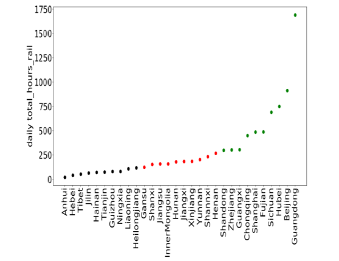

## **数据——描述统计**
<div align=center >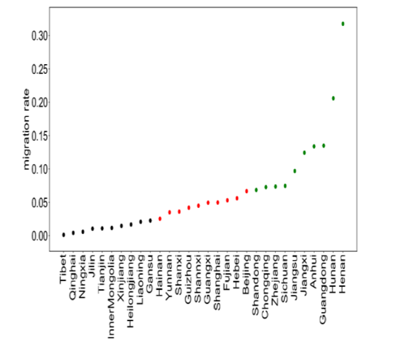

## **建模过程**

假定每日新增病例数服从泊松分布  

d$Y_{kt}$ = $Y_{kt}$ - $Y_{k，t-1}$ ~ Possion(${\gamma}_{kt}$$W_{k,t-1}$)  
  
接下来就需要关注${\gamma}_{kt}$和$W_{kt}$这两个参数  

首先，关注${\gamma}_{kt}$。${\gamma}_{kt}$ = ${\eta}_{kt}$ $\times$ ${\gamma}_{k，t-1}$   &emsp;&emsp;${\eta}_{kt}$=${\eta}_{t}$
  
${\eta}_{kt}$可以看做是${\gamma}_{kt}$的导数，将它定义为t的任意函数，本文将用非参数逐点估计的方法将其估算出来

## **建模过程**  
  
其次，关注$W_{kt}$  
$$
dW_{kt} = {\gamma}_{kt} \times W_{k，t-1} ， W_{kt} = W_{k，t-1} + dW_{kt}  
$$
经过链式计算后，可以得到  
$$
dW_{kt} = {\gamma}_{kt} \prod_{j=1}^{t-1} ({\gamma}_{k,j} +1)W_0 , W_{kt} =  \prod_{j=1}^{t-1} ({\gamma}_{k,j} +1)W_0  
$$
其中，$W_0$ = ${\alpha}_k$，${\alpha}_k$为1月20日基准病例  

接下来，关注${\alpha}_k$，定义${\alpha}_k$是由武汉通过不同交通方式迁出到全国各地所决定，即  

## **建模过程**  

$$
{\alpha}_k = {\beta}_1 \times {TR}_k + {\beta}_2 \times {TR}_k + {\beta}_3 \times {MI}_k  
$$
其中，${\beta}$ = (${\beta}_1$,${\beta}_2$,${\beta}_3$)'是待估参数

进一步，完善模型  
$$
W_{kt} = \prod_{j=1}^{t-1}({\gamma}_{k,j} +1){\alpha}_k - \prod_{j=1}^{t-(m+1)}({\gamma}_{k,j} +1){\alpha}_k(t\gt m)  
$$
令${\gamma}_{1}$=(${\gamma}_{1}$,...,${\gamma}_{k1}$)' , $\delta$ = (${\gamma}_{1}$',a',${\beta}$')

综上，由泊松分布的概率函数P(X=k)=$\frac {{\lambda}^k}{k!}$,k=0,1,...得到对数似然函数  

## **建模过程**
  
接上，
$$
L(\delta) = \sum_{k=1}^K\sum_{t=1}^T{[dY_{kt}log({\lambda}_{kt}) - {\lambda}_{kt}}]+c  
$$

$$
= \sum_{k=1}^K\sum_{t=1}^T(dY_{kt}log[{\gamma}_{kt}{X}_{k}^T{\beta}{ \prod_{j=1}^{t-1}({\gamma}_{k,j} +1)-\prod_{j=1}^{t-(m+1)}({\gamma}_{k,j} +1)}] \\- {\gamma}_{kt}{X}_{k}^T{\beta}{\prod_{j=1}^{t-1}({\gamma}_{k,j} +1)-\prod_{j=1}^{t-(m+1)}({\gamma}_{k,j} +1)})+c 
$$

## **结果展示**  

<div align=center >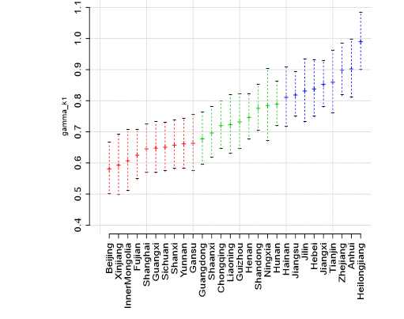

## **结果展示**  

<div align=center >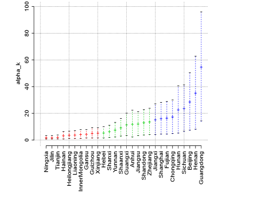

## **结果展示**  

<div align=center >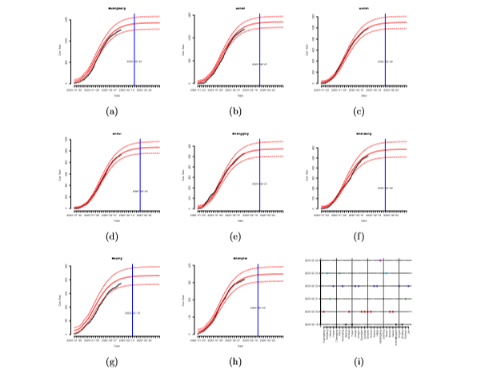

## **结果展示**  

<center>表1：交通方式和人口迁移对基准感染病例的影响</cenetr>

<div align=center >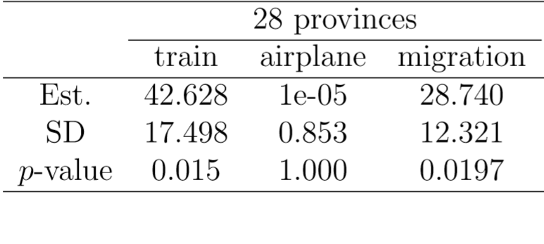


# 2.非参数核密度估计方法

## **参数估计 VS 非参数估计**

参数估计：假设总体服从带未知参数的某种分布或具体的回归函数，并据此估计其未知参数。其优点是比较有效率且容易操作，其缺点是对模型设定所作的假定较强，可能导致较大的“设定误差”。  

非参数估计：一般不对模型的具体分布或函数形式作任何假定，是一种从数据样本本身出发研究数据分布特征的方法，因此更加稳健。但其缺点是，要求的样本容量较大，且估计量收敛到真实值的速度较慢。  

## **直方图的缺陷**
在非参数估计中，画直方图是一种被广泛应用的密度函数估计方法，但是它存在一定的缺陷:  
1. 得到的密度函数是不光滑的；  
2. 密度函数受子区间宽度影响较大。  

其中，直方图不能得到光滑密度估计的根本原因是由于它使用了示性函数作为权重函数，并且它的各组之间不允许交叠。  
<br>

<div align=center>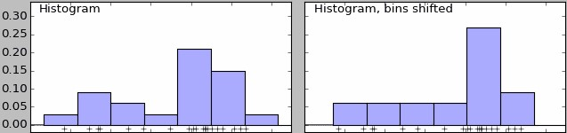</div>

## **核函数**
为了让核密度估计得到光滑的密度函数，我们需要让它使用更一般的权重函数，并允许各组交叠。其中，权重函数就是“核函数”。  

在核密度估计中，核函数通常选择平滑的峰值函数来拟合远小近大的权重规律，且要求选择函数满足下面两个性质：  
1. 归一化：曲线下方面积为1；  
2.对称性：函数连续且关于原点对称。  
<div align=center>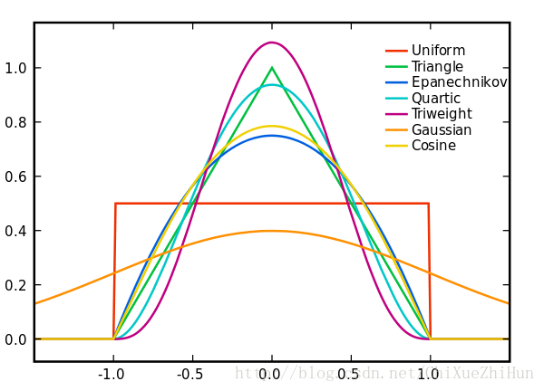</div>

## **核密度估计**
所谓核密度估计，就是采用平滑的峰值函数(“核函数”)来拟合观察到的数据点，从而对真实的概率分布曲线进行模拟。
<br>

<div align=center>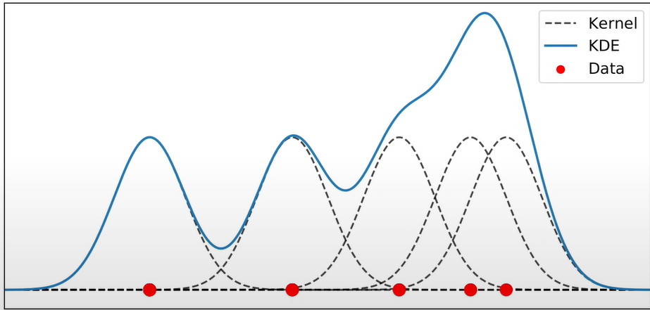</div>

## **带宽**
核密度估计无法消除直方图中“密度函数受子区间宽度影响”的影响。

带宽：子区间的半径，定义了“在数据点附近邻域的大小”，通常用h表示；  
窗宽：子区间的直径，通常用2h表示。  

带宽反映了密度函数曲线整体的平坦程度，也即观察到的数据点在曲线形成过程中所占的比重。带宽越大，观察到的数据点在最终形成的曲线形状中所占比重越小，整体曲线就越平坦；带宽越小，观察到的数据点在最终形成的曲线形状中所占比重越大，整体曲线就越陡峭。  

## **带宽对密度函数的影响**

<center class='half'>
  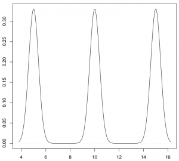</div>
  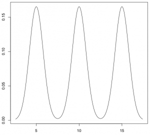</div>
</center>
<br>
<center class='half'>
  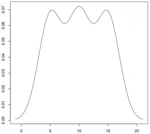</div>
  </div>
</center>

## **最优带宽**
在核密度估计中，带宽的选择远比核函数的选择更重要。  

如果带宽越大，数据点附近的邻域就越大，偏差也越大(偏差与$h^2$成正比)；另一方面，如果带宽越大，密度函数曲线就越光滑，即方差越小(方差与$\frac{1}{nh}$成正比)。

因此，在选择最优带宽时，为保证偏差和方差都不大，我们最小化均方误差(MSE)，即使估计量方差与偏差平方和最小。  

$$
\min _{h} \operatorname{MSE}\left[\hat{f}\left(x_{0}\right)\right]=\left[\operatorname{Bias}\left(x_{0}\right)\right]^{2}+\operatorname{Var}\left[\hat{f}\left(x_{0}\right)\right]
$$

## **非参数核回归**
非参数核回归是利用核函数和带宽构建的一种非参数回归方法。考虑以下非参数一元非参数回归模型：
$$
y_{i}=m\left(x_{i}\right)+\varepsilon_{i}
$$

该模型的困难(与优点)在于$m(.)$是未知函数(连函数形式都未知)。因此我们只知道x与y之间存在回归关系，但是无法知道其具体表达式。  

非参数回归的思想是：对于每个i，分别估计$m\left(x_{i}\right)$，从而得到对回归函数$m(x)$的估计。在某种意义上，这种回归方法并不用于求模型的解析解，而求其数值解。

## **非参数核回归**

<div align=center>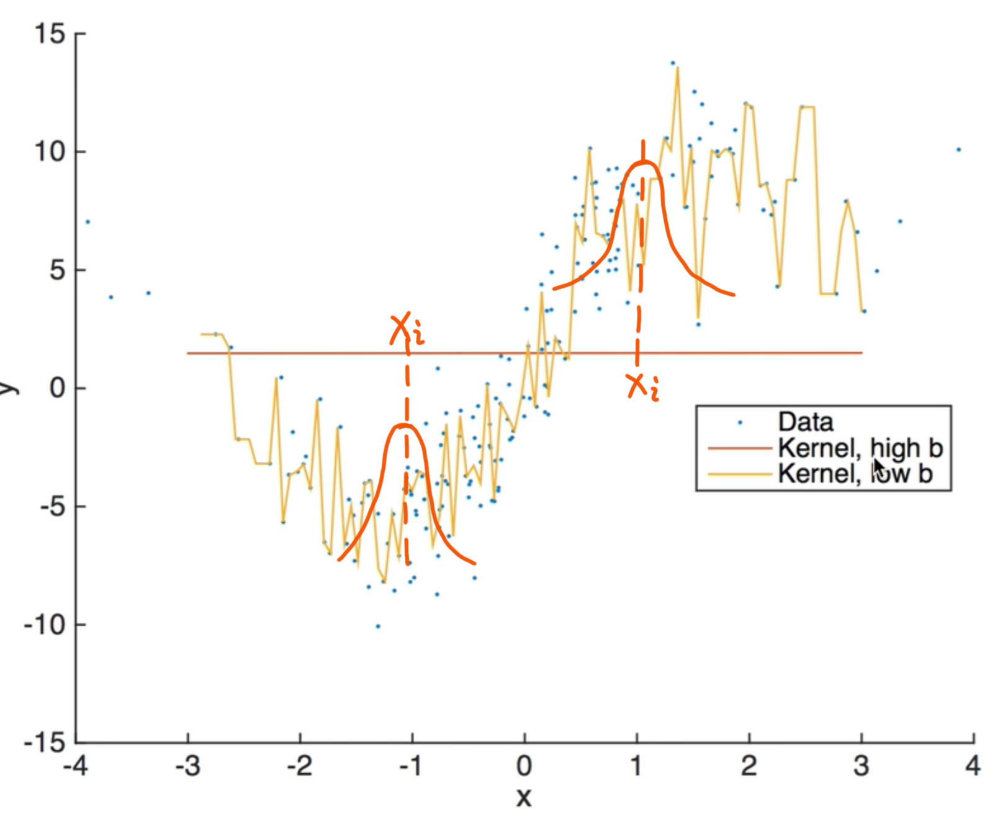</div>


# 3.R语言实操简介

## **核密度估计**

```{r ,eval=FALSE}
set.seed(10)  
dat<-c(rgamma(300,shape=2,scale=2),rgamma(100,shape=10,scale=2))  
plot(density(dat,kernel = "gaussian" ), ylim=c(0,0.2))  
dfn<-function(x,a,alpha1,alpha2,theta){  
  a*dgamma(x,shape=alpha1,scale=theta)+(1-a)*dgamma(x,shape=alpha2,scale=theta)}  
curve(dfn(x,0.75,2,10,2),add=T,col="red")  

```  
<div align=center>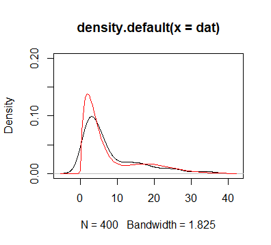</div>

## **带宽的选择**
```{r ,eval=FALSE}
dfn1<-function(x){  
  0.5*dnorm(x,3,1)+0.5*dnorm(x,-3,1)}  
par(mfrow=c(2,2))  
curve(dfn1(x),from=-6,to=6)  
data<-c(rnorm(200,3,1),rnorm(200,-3,1))  
plot(density(data,bw=8))  
plot(density(data,bw=0.8))  
plot(density(data,bw=0.08))

```


## **带宽的选择**
<div align=center>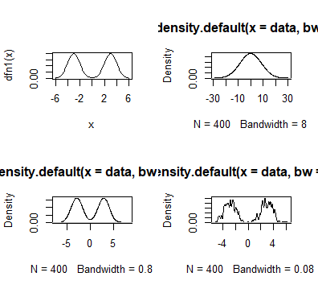</div>

## **武汉人员迁徙地图**
```{r ,eval=FALSE}
library(usethis)
library(devtools)
library(REmap)
options(remap.ak = "9H3FoljQv8CGKeWWrxtFVNEGCTd8Ui8z" )   
destin <- read.csv(file="./supplement/destination.csv",header=F)
names(destin) <- c("names","values")
markLine_data <- data.frame(origin=rep("武汉",10),
                            destination=destin[1:10,1],
                            color=rep("#fff",10)
)
markPoint_data <- markLine_data[markLine_data!=""]
markPoint_data1 <- markPoint_data[which(markPoint_data!="武汉"&markPoint_data!="#fff")]

```

## **武汉人员迁徙地图**
```{r ,eval=FALSE}
remapC(destin, title="2020年1月10日至2020年1月24日 武汉人口迁出图", subtitle="前10目标省份",
       theme=get_theme(theme="Dark",  #背景颜色
                       lineColor = "#FFFFFF",  #线条颜色
                       titleColor = "#FFFFFF",  #标题颜色
                       pointShow = T,  #是否展示各省会城市所在点，设置为True时展示
                      ),
       color=c('#CD0000','#FFEC8B'), #颜色渐变方案 
       markLineData=markLine_data,   
       markLineTheme=markLineControl(color="white", 
                                     lineWidth=2, #线条宽度
                                     lineType="dashed"   #线条形状：虚线
                                    ),  #对图中线的样式进行调整
       markPointData=markPoint_data1,
       markPointTheme=markPointControl(symbolSize=13,  #调整点的大小
                                       effect=T,     #调整点是否显示动态效果
                                       effectType="scale",    #调整点的形状
                                       color="white"
                                      )  #对图中点的样式进行调整
)
```

## **全国疫情地图**
```{r ,eval=FALSE}
library(REmap)
data <- read.csv(file="./supplement/data.csv",header=F)
names(data) <- c("names","values")
remapC(data,
       maptype = 'china',
       color = c('#CD0000','#FFEC8B'),   
       theme = get_theme("dark"),
       title = "全国疫情地图",
       subtitle="2月11日累计确诊人数",
)
```
